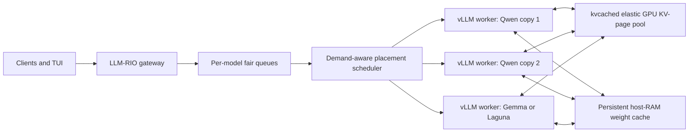
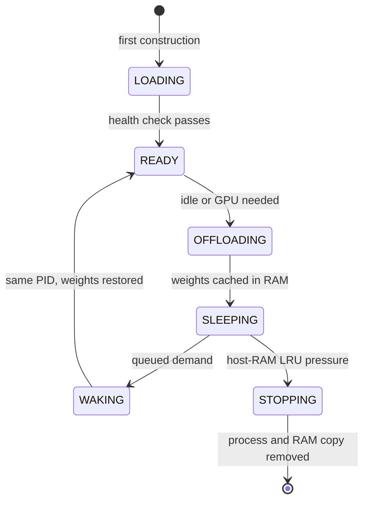

# Prism live demo and implementation talk track

## The claim to make on stage

LLM-RIO implements the operational behavior that matters in Prism: multiple
models share a small GPU fleet, KV memory is elastic, idle model weights move
to host RAM, cached models reactivate quickly, and demand controls placement.
It does **not** copy Prism's research SGLang fork or its generic worker-pool
implementation. It realizes the same serving pattern with current vLLM
workers, kvcached, and an LLM-RIO scheduler.

Use the phrase **"Prism-style, behavior-compatible implementation on vLLM"**.
Do not say that this is the original Prism runtime.



## What is implemented

### GPU KV memory

kvcached gives each vLLM engine virtual KV capacity while allocating physical
GPU pages on demand. Completed requests return pages to the shared pool. This
is the spatial-sharing part: colocated engines do not each reserve their full
worst-case KV cache up front.

### Model-weight memory

Each placement is a real, model-specific vLLM process. When it becomes idle,
LLM-RIO calls vLLM's authenticated `POST /sleep?level=1` endpoint. vLLM frees
the GPU allocations, backs immutable model weights in CPU RAM, and discards
reconstructible GPU state. The process and private API port remain alive.

LLM-RIO adds a vLLM 0.26 compatibility shim that preserves those immutable CPU
weight tensors after `wake_up`. Without the shim, vLLM clears the backup and a
later sleep copies the full model from GPU to CPU again. With it, repeated
sleep/wake cycles reuse the same host copy.

The runtime state path is:



A `SLEEPING` worker is a warm cache hit. A stopped or never-created worker is a
cold load. The sub-ten-second claim applies to the warm path, not to first-time
download, validation, compilation, or a worker evicted from the bounded RAM
cache.

### Scheduling and safety

- The scheduler considers queue age, estimated token work, validated TP shape,
  measured peak and sleeping VRAM, GPU headroom, and cached-worker limits.
- It wakes an existing RAM-cached worker before constructing a new one.
- It may sleep an idle model to make GPU room, but never sleeps or evicts a
  worker with admitted requests.
- Requests route to the ready replica with the least outstanding token work.
- Token pressure can request more replicas, but replica count is capped by
  concurrent requests because one request cannot be split across replicas.
- Repeating a model name in `prism_preload_models` requests multiple cached
  copies. Two Qwen entries produce two independent TP=1 vLLM engines, one per
  GPU; they are replicas, not TP=2 ranks and not one shared process.
- If the configured host-RAM cache is full, sleeping workers are evicted in LRU
  order. Calling an evicted model requires a cold load.

### Automatic registration

Registration is asynchronous and fail-closed:

1. Resolve the repository and immutable revision.
2. Check local disk and download the snapshot.
3. Inspect model metadata and derive candidate TP/GPU placements.
4. For every candidate, test generation, sleep, VRAM release, wake, and
   post-wake generation on the current host.
5. Publish only passing profiles and mark the catalog model `AVAILABLE`.
6. Request one warm placement so the first later chat can use host RAM.

Validation yields to production demand and will requeue rather than evict an
active inference worker.

## Verification status on this two-GPU host

The restored implementation is committed on branch `prism`. Its current
non-GPU acceptance gates pass:

- 47 retained and restored automated tests.
- 19 focused Prism runtime/transition tests.
- Ruff on every restored or changed Python file.
- The real vLLM 0.26 worker bootstrap reports all six required compatibility
  shims installed.
- An isolated no-preload control plane served correctly on port 3737 and shut
  down cleanly.

The full GPU rehearsal must be rerun before presenting. The numbers below are
prior successful Sep. 2 rehearsal evidence, not a claim about the currently
stopped service:

| Prior rehearsal behavior | Observed result |
|---|---:|
| Six-call Qwen/Gemma/Laguna sequence | 3.065-4.386 s end to end; all HTTP 200 |
| Switch queue/activation wait | 1.169-2.410 s |
| Complete switching run | 27.38 s |
| Qwen burst | 40/40 requests; 17,236 completion tokens; zero errors |
| Qwen burst routing | Exact 20/20 split across the two TP=1 workers |
| Burst wall time | 22.62 s |

A preserved Gemma worker log also demonstrates the intended mechanism: the
first RAM offload took about 9.8 s, RAM wake took about 0.83 s, and later
sleep/wake cycles reused the same process and host copy. A separate restart
storm failed because its worker lacked the packed-KV compatibility shim; the
restored branch now installs that shim and tests its bootstrap marker.

DeepSeek-V4-Flash-0731 is not part of the live switching sequence. On this
SM120 host, vLLM 0.26 reaches an upstream sparse-MLA backend incompatibility.
Keep the catalog entry in `NEEDS_ADMIN_REVIEW` and use Laguna-S-2.1 as the third
large model.

## Before the audience arrives

Allow at least fifteen minutes for cold preload construction. Compilation,
graph capture, multimodal warmup, and the first GPU-to-RAM copy are not the
warm-switch latency being demonstrated.

Use four panes:

1. LLM-RIO service logs.
2. The LLM-RIO TUI on its Models/Jobs or GPU dashboard page.
3. `watch -n 0.5 nvidia-smi`.
4. The homepage generator and chat client.

Use the isolated worktree and rehearsal database. Do not launch the stable
`main` checkout for this demo:

```bash
cd /tmp/llm-rio-prism-single-machine
test "$(git branch --show-current)" = prism
git status --short --branch
grep -nE '^(api_host|api_port|database_path|prism_preload_models|prism_weight_cache_mode)' \
  /tmp/llm-rio-prism-rehearsal/config.toml
```

Confirm port 3737 is free, port 8002 is still the protected proxy, and the GPUs
are available for the rehearsal:

```bash
ss -ltnp | grep -E ':(3737|8002)\b' || true
nvidia-smi --query-gpu=index,name,memory.used,utilization.gpu --format=csv,noheader
```

Run the fail-fast preflight and continue only if its summary says `PASS`:

```bash
/.gavea/store/song669/LLM-RIO/.venv/bin/python prism_demo_preflight.py \
  --config /tmp/llm-rio-prism-rehearsal/config.toml --phase before-start
```

Set the isolated endpoint without putting a credential in shell history:

```bash
export LLMRIO_BASE_URL=http://127.0.0.1:3737/v1
read -rsp 'LLM-RIO API key: ' LLMRIO_API_KEY; export LLMRIO_API_KEY; echo
```

Keep `minimum_residency_seconds = 0` and `prism_idle_sleep_seconds = 15` in
the rehearsal config. The optional anti-thrashing hold deliberately delays
replacement and is not part of warm activation.

Restart the port-3737 service from the current source before rehearsal or the
presentation. A Python service that was already running when code changed does
not pick up the scheduler fix.

Start the restored source in pane 1:

```bash
cd /tmp/llm-rio-prism-single-machine
PYTHONPATH="$PWD/src" \
  /.gavea/store/song669/LLM-RIO/.venv/bin/python -m llm_rio.cli serve \
  --config /tmp/llm-rio-prism-rehearsal/config.toml
```

Start the TUI in pane 2:

```bash
cd /tmp/llm-rio-prism-single-machine
export LLMRIO_CONFIG=/tmp/llm-rio-prism-rehearsal/config.toml
export LLMRIO_API_URL=http://127.0.0.1:3737
PYTHONPATH="$PWD/src" \
  /.gavea/store/song669/LLM-RIO/.venv/bin/python -m llm_rio.cli interactive
```

Start the GPU display in pane 3:

```bash
watch -n 0.5 nvidia-smi
```

Prepare pane 4:

```bash
cd /tmp/llm-rio-prism-single-machine
export LLMRIO_BASE_URL=http://127.0.0.1:3737/v1
read -rsp 'LLM-RIO API key: ' LLMRIO_API_KEY; export LLMRIO_API_KEY; echo
```

Before going on stage, confirm the dashboard shows:

- Laguna TP=2, `SLEEPING`, `weight_storage=host_ram`.
- One validated Gemma placement, `SLEEPING`, `weight_storage=host_ram`.
- Two Qwen TP=1 workers on distinct GPUs, both `SLEEPING`.
- No temporary `qwen3-8b-q8` catalog row or local Hugging Face cache. Otherwise
  the registration act will be a duplicate or a cache hit instead of a real
  add-and-download demonstration.

Do not use or expose port 8002. All demo traffic goes through LLM-RIO on 3737;
private worker ports stay bound to `127.0.0.1`.

With `LLMRIO_API_KEY` set in pane 4, make the dashboard requirements an
executable gate:

```bash
/.gavea/store/song669/LLM-RIO/.venv/bin/python prism_demo_preflight.py \
  --config /tmp/llm-rio-prism-rehearsal/config.toml --phase ready
```

## Live demo: 7-9 minutes

### Opening: 30 seconds

**Action:** Show the TUI dashboard beside `nvidia-smi`.

**Say:**

> These model processes already exist, but their weights are not occupying the
> GPUs. The dashboard calls them sleeping and shows host RAM as the weight
> tier. The two GPUs could not hold all these models at full serving residency.
> A request will wake only the model it needs, without rebuilding its engine.

Point out the stable worker IDs and the two distinct Qwen TP=1 placements.

### Act 1 — add and validate a model: 60-90 seconds now, revisit later

**Action:** In the TUI Models page, choose **Add model** and submit:

```text
Nickname: qwen3-8b-q8
Repository: Qwen/Qwen3-8B-FP8
Revision: leave blank to resolve the current immutable revision
```

Open the registration job and leave it visible long enough to show the stages
`resolve`, `download`, `validation_pending`, and `validating`.

**Say:**

> This is an administrative operation, not a hand-written deployment. LLM-RIO
> resolves and downloads the checkpoint, discovers placement shapes, and tests
> generation plus a full sleep/wake/post-wake cycle. Production traffic has
> priority, so validation yields and requeues if these GPUs become busy. We will
> continue the demo and come back when the model is available.

Do not wait on this screen.

### Act 2 — burst one model across both GPUs: about 2 minutes

**Action:** Start the 40 concurrent Qwen fill-in jobs and keep `nvidia-smi`
plus the TUI GPU dashboard visible:

```bash
/.gavea/store/song669/LLM-RIO/.venv/bin/python prism_homepage_demo.py
```

The command prints each completed module, cumulative GPU/worker activity, the
final token count and worker distribution, then writes a filled local HTML
blueprint and a JSON evidence report under `diagnostics/`.

**Say while the first wave starts:**

> This is one logical model name, but it has two independent TP=1 replicas.
> The scheduler wakes one cached copy per GPU and routes each request to the
> replica with the least outstanding token work. It never offloads a worker
> that has an admitted request.

**Point out:**

- Both Qwen worker IDs transition `SLEEPING -> WAKING -> READY`.
- Both GPUs become busy with the same model.
- Active-request counts and outstanding token work change independently.
- Other idle models may sleep, but Qwen remains resident until its jobs finish.
- The generated page fills progressively; total completion tokens increase.

**After completion, say:**

> The two replicas are ordinary independent vLLM continuous-batching engines.
> Prism is not slowing an active decode by moving its weights. It changes
> residency only at safe request boundaries.

The prior rehearsal produced 17,236 completion tokens with zero errors and
split all 40 requests exactly 20/20. Present the live values; label the prior
numbers clearly if you need them as a fallback.

### Act 3 — rapid model switching: about 3 minutes

**Action:** In the chat client, send one short prompt at a time in this order:

```text
Qwen -> Gemma -> Laguna -> Qwen -> Gemma -> Laguna
```

The repeatable terminal version is:

```bash
/.gavea/store/song669/LLM-RIO/.venv/bin/python prism_switch_demo.py --rounds 2
```

It prints live dashboard samples, the initial state, serving worker, queue wait,
and end-to-end time for every switch, and fails if a call reaches ten seconds.


Keep prompts short so the visible time is dominated by activation rather than
generation. Use the same prompt for each model, for example:

```text
In one sentence, explain why a sleeping model can wake faster than a cold model.
```

**Say:**

> Watch the model state and VRAM, not just the chat spinner. The requested model
> wakes from host RAM using the same PID. If GPU room is needed, the scheduler
> first sleeps an idle model. The KV allocator then grows only for the active
> request. No checkpoint is being reread from disk on this path.

After each response, point to `last_activation_seconds`, `weight_storage`, and
the corresponding `nvidia-smi` change. Do not promise exactly 1.5 seconds for
the whole HTTP call. Prior evidence showed roughly one-to-two-second activation
and 3.065-4.386-second end-to-end calls; use the newly rehearsed measurements
for the live claim.

### Return to Act 1: 45-60 seconds

**Action:** Return to the Models/Jobs page. When `qwen3-8b-q8` is `AVAILABLE`,
send it one short chat request through the normal port-3737 client.

**Say:**

> The model became callable only after every validation gate passed. LLM-RIO
> also requested a one-time warm placement, so this request can use a validated
> RAM-cached worker rather than an untested cold engine.

If the job is still validating, show its current stage and say that this is the
intended asynchronous behavior. Finish with the already-completed switching
result rather than waiting silently.

## Closing: 30 seconds

> The important distinction is between cold construction and warm activation.
> First-time model onboarding is deliberately thorough and can take minutes.
> Once validated and cached, the same engines switch in seconds while elastic
> KV memory follows active demand. This is Prism's operational idea implemented
> on vLLM, not a claim that we copied the original SGLang research artifact.

## Failure-safe presentation fallbacks

- **New model is still downloading:** show the job stage and continue. That
  demonstrates asynchronous administration rather than a failure.
- **New model validation requeues:** point to concurrent production demand;
  yielding is the intended safety policy.
- **A switch exceeds ten seconds:** check whether the worker began in
  `SLEEPING` or was cold/LRU-evicted. Report cold and warm paths separately.
- **DeepSeek is requested:** use Laguna and state the documented SM120 sparse
  MLA incompatibility; do not attempt an unqualified backend override live.
- **A model returns slowly:** distinguish activation, queue wait, and decode
  using `last_activation_seconds`, the queue-wait header, and token throughput.
- **The TUI display lags:** press `R`; the underlying service and worker PIDs
  continue independently.

## Claims to avoid

- "We reimplemented the original Prism worker pool." We did not.
- "kvcached stores model weights." kvcached manages elastic KV pages; vLLM
  sleep plus the LLM-RIO shim provides the host-RAM weight cache.
- "Every model always wakes from RAM." A sleeping model does; an LRU-evicted
  or never-initialized model is cold.
- "The first download takes 1.5 seconds." The paper's fast activation result
  and this demo's measurements concern a preinitialized, RAM-cached model.
- "Two Qwen GPUs are tensor parallel." They are two TP=1 replicas.
