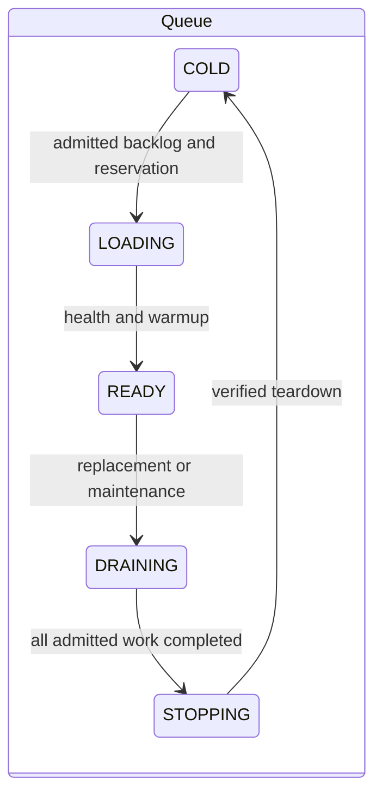
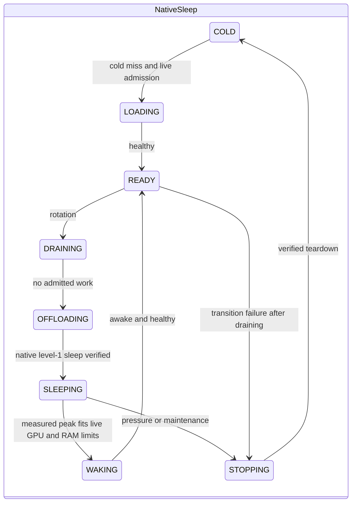

# Architecture and ownership

| Layer | Modules | Ownership |
| --- | --- | --- |
| Interfaces | `api`, `commands`, `ui`, `cli`, `tui` | Authentication, validated input, presentation |
| Application | `registration`, `profiles`, `services` | Persisted jobs, profile edits/trust, access, diagnostic snapshots |
| Common runtime | `runtime`, `workers`, `queueing`, `ports` | Request leases, authoritative worker registry, reservations, shutdown |
| Modes | `modes/queue`, `modes/vllm_sleep`, `modes/kv_cached` | Planner, settings, residency lifecycle, validation budgets |
| Engines | `engines/launch`, `engines/identity`, validators | Effective launch specifications, transport, probes and evidence |
| Infrastructure | `repositories`, `storage`, `inventory`, `process_cleanup`, `artifacts` | SQLite, telemetry, process groups, artifact identity |

`modes.factory.create_mode` constructs the selected policy once at startup.
`ModePolicy` exposes planning, capabilities, and `ProfileEligibility` with stable
reason codes. Native selection never imports experimental bootstrap/patch code.
Mode packages must not import another mode's policies. Shared cache-limit schemas
and resource safety mechanisms do not select residency policy.

`WorkerSupervisor.workers` is the authoritative registry. The scheduler owns request
leases and validation GPU reservations. Both validation and serving use the supervisor's
`PortAllocator`. A port or GPU reservation is retained when process/GPU teardown cannot
be verified. An unsuccessful kill is not evidence that capacity is reusable.

The database facade delegates to identity, catalog, accounting, and event repositories.
One connection and one transaction lock define the transaction boundary; atomic quota
reservation and idempotent settlement stay within it. Interfaces consume diagnostic
snapshots rather than accessing planner state.

Validation and serving build the same `LaunchSpec`. Saved evidence is bound to mode,
engine/version, launch environment, artifact revision, UUID placements, and measurement
format. Administrative activation is separate from measurement eligibility. Launch edits
invalidate evidence. Advanced trust copies eligible saved evidence to the current machine
fingerprint and records actor, reason, source profile, and source fingerprint. It does not
create missing measurements or undo invalidation.

Experimental residency uses its own lifecycle with elastic KV placement. It shares
verified teardown, telemetry, reservation, and accounting mechanisms with native modes.
Failed transitions retain ownership until teardown succeeds; failures never permit a
second worker to claim uncertain GPU capacity.

## Reviewed release boundary decisions (AUD-10)

The native planners/lifecycles independently own placement and residency decisions.
Queue now owns replica scale-window/marginal-gain settings, and has no sleep-cache
constructor arguments or unreachable preemption policy. Sleep owns host-cache
pressure serialization. The following shared mechanisms are deliberate release
boundaries, revising the initial proposal to move every state field into a mode:

- The authoritative `WorkerPlacement` record keeps a superset of telemetry fields,
  including sleep evidence. Keeping one record avoids competing lifetime owners and
  makes diagnostic snapshots uniform. Queue never uses sleep policy to place work.
- Common eligibility validates artifact/launch identity and measurement integrity;
  the selected mode supplies the required evidence/backend contract. Duplicating
  cryptographic binding or finite-measurement checks would risk divergent trust rules.
- Common runtime executes preload/transition actions and owns reservations. Mode
  planners decide placement; lifecycle implementations decide sleep and eviction.
  Shared deadline/fairness inputs are configuration, not runtime mode switches.
- Engine adapters own deterministic launch construction. Validators and engine
  transport own asynchronous probe sequences, coordinated with shared GPU/port
  reservations. Moving those sequences into the launch-only adapter would introduce
  a runtime dependency cycle without changing ownership.
- CLI/TUI share a functional administration client. Validation has a typed request
  operation and typed response; extensible engine/catalog payloads remain JSON
  dictionaries. The unused class facade was removed. This is not a generated,
  fully typed SDK and should not be described as one.

A single application constructs exactly one mode. Process-lifetime database/GPU
locks precede startup reconciliation. Backup acquires the database owner lock.
Validation-job changes occur in one transaction, including duplicate-submit checks
and the selected profile snapshot; launching starts only after that transaction.
The test kit checks the running source fingerprint against the recorded wheel.
