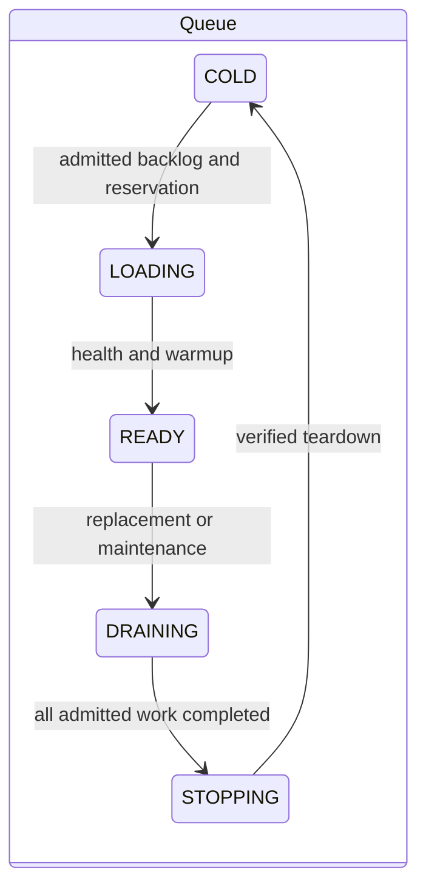
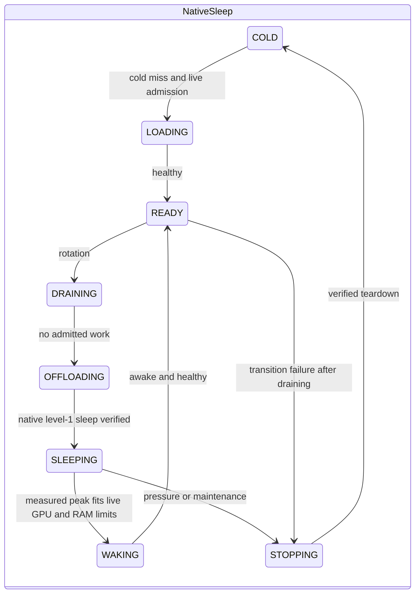

# Architecture and ownership

| Layer | Modules | Ownership |
| --- | --- | --- |
| Interfaces | `api`, `commands`, `ui`, `cli`, `tui` | Authentication, validated input, presentation |
| Application | `registration`, `profiles`, `services` | Persisted jobs, profile edits/trust, access, diagnostic snapshots |
| Common runtime | `runtime`, `workers`, `queueing`, `ports` | Request leases, authoritative worker registry, reservations, shutdown |
| Modes | `modes/queue`, `modes/vllm_sleep`, `modes/kv_cached` | Planner, settings, residency lifecycle, validation budgets |
| Engines | `engines/launch`, `engines/identity`, validators | Effective launch specifications, transport, probes and evidence |
| Infrastructure | `repositories`, `storage`, `inventory`, `process_cleanup`, `artifacts` | SQLite, telemetry, process groups, artifact identity |

`modes.factory.create_mode` constructs the selected policy once at startup.
`ModePolicy` exposes planning, capabilities, and `ProfileEligibility` with stable
reason codes. Native selection never imports experimental bootstrap/patch code.
Mode packages must not import another mode's policies. Shared cache-limit schemas
and resource safety mechanisms do not select residency policy.

`WorkerSupervisor.workers` is the authoritative registry. The scheduler owns request
leases and validation GPU reservations. Both validation and serving use the supervisor's
`PortAllocator`. A port or GPU reservation is retained when process/GPU teardown cannot
be verified. An unsuccessful kill is not evidence that capacity is reusable.

The database facade delegates to identity, catalog, accounting, and event repositories.
One connection and one transaction lock define the transaction boundary; atomic quota
reservation and idempotent settlement stay within it. Interfaces consume diagnostic
snapshots rather than accessing planner state.

Validation and serving build the same `LaunchSpec`. Saved evidence is bound to mode,
engine/version, launch environment, artifact revision, UUID placements, and measurement
format. Administrative activation is separate from measurement eligibility. Launch edits
invalidate evidence. Advanced trust copies eligible saved evidence to the current machine
fingerprint and records actor, reason, source profile, and source fingerprint. It does not
create missing measurements or undo invalidation.

Experimental residency uses its own lifecycle with elastic KV placement. It shares
verified teardown, telemetry, reservation, and accounting mechanisms with native modes.
Failed transitions retain ownership until teardown succeeds; failures never permit a
second worker to claim uncertain GPU capacity.
