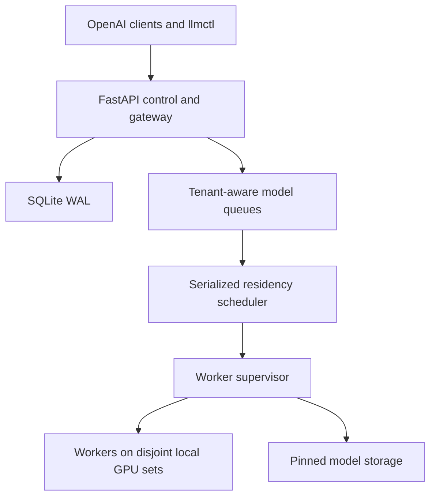

# LLM-RIO LLM Router for Inference Optimization
# Greenfield Architecture: Automatic Multi-User LLM Service

## 1. Goal and boundary

Build an LLM API for one Linux/HPC host with one or more locally visible NVIDIA GPUs. It should offer an Ollama-like model experience while targeting much higher aggregate token throughput under parallel research workloads.

The central rule is:

> Staff control the model catalog, access, and quotas. The application controls queues, GPU placement, loading, replication, draining, and unloading.

An admin, professor, or TA submits a Hugging Face model reference. The application downloads and validates it, then adds it to the available catalog. Users may request any catalog model granted to their API key. No person chooses a GPU or manually deploys a model.

Deployment assumptions:

- One installation controls one machine and its configured local GPUs.
- GPU count, model, VRAM, and interconnect topology are discovered at installation and startup; they are not compiled into scheduler logic.
- A machine may have 2 x RTX PRO 6000, 8 x RTX 4070, 4 x L40S, or another supported local configuration (may be mixed).
- Each lab machine runs a separate installation, API, catalog, database, queue, and scheduler. Deploying the software to every machine is supported, but there is no shared queue, cross-machine placement, multi-node inference, Kubernetes, or aggregate control plane.
- No Docker, `sudo`, GUI, or Ray.
- User-space installation with `uv`.
- OpenAI-compatible inference endpoints plus authenticated management endpoints.
- An admin-oriented CLI that calls the same management API.
- vLLM as the primary engine; versioned llama.cpp/GGUF support only as a tested fallback.
- No normal CPU weight or KV-cache offloading.
- The common workload is many parallel requests to one mid-sized model.

The scheduling unit is a **worker placement**: one inference worker owns one validated set of one or more local GPU UUIDs. Independent workers never share a GPU initially. A one-GPU model may have as many replicas as demand and free GPUs justify; a larger model may use a validated multi-GPU tensor-parallel placement. These placements may coexist on disjoint GPU sets.

Benchmark the finished service against Ollama using identical artifacts and workloads. The main metric is aggregate output tokens/second; also record time to first token, inter-token latency, cold-load time, error rate, and maximum queue wait. Higher throughput is a target that must be measured, not assumed.

## 2. Roles, keys, and interface

| Capability | User | TA | Admin |
|---|---:|---:|---:|
| Run inference; list granted models | Yes | Yes | Yes |
| View own usage and balance | Yes | Yes | Yes |
| Request/disable catalog models | No | Yes | Yes |
| Change model grants on existing keys | No | Yes | Yes |
| Create, rotate, revoke, or delete keys | No | No | Yes |
| Change quota or unlimited status | No | No | Yes |
| Enter/leave maintenance | No | No | Yes |

Every API key has a recognizable nickname, role, quota account, and explicit model allowlist. An empty allowlist means no access. Admin keys are unlimited; selected staff keys may also be marked unlimited.

Only the admin is expected to use the local CLI. Nearly all functionality must also be available through authenticated HTTP endpoints so trusted staff can operate remotely. The CLI remains a thin client, not a second control path.

## 3. Minimal architecture



Keep each machine-local installation small:

- One FastAPI control/gateway process.
- SQLite in WAL mode for keys, grants, catalog, jobs, quotas, and recovery state.
- Bounded in-process queues divided by model and then quota account/key.
- One event-driven scheduler loop as the authority for runtime state changes.
- One inference subprocess per placement, pinned to one or more GPU UUIDs and a private port.
- No PostgreSQL or Redis until measurement proves one control process is inadequate.

Within each model queue, use weighted or deficit round-robin across tenants. A team sending 32 requests must not monopolize admission. vLLM still owns token-level continuous batching.

### Request path

1. Authenticate the key.
2. Resolve the model alias.
3. Return `model_not_found` for an unknown alias or `model_not_allowed` for a known but ungranted model. Both may include the caller's available-model list.
4. Validate the model's capabilities and request limits.
5. Reserve worst-case token credit in a short database transaction.
6. Enqueue by model and tenant.
7. Route to a ready worker, or wait while the scheduler obtains capacity.
8. Stream the result and settle actual usage in a guaranteed cleanup path.

## 4. Catalog and runtime are separate

```text
Catalog: REQUESTED -> DOWNLOADING -> VALIDATION_PENDING -> VALIDATING -> AVAILABLE
                    any failure -> NEEDS_ADMIN_REVIEW; AVAILABLE -> DISABLED

Runtime: COLD -> LOADING -> READY -> DRAINING -> STOPPING -> COLD
```

Staff change catalog state. `AVAILABLE` means a model is callable by authorized keys; it does not mean it occupies VRAM. Only the scheduler changes runtime state. There is no ordinary API for choosing GPU placement, replica count, or deployment.

## 5. Automatic model registration

Staff submit a small request:

```http
POST /staff/models
{
  "nickname": "research-model",
  "huggingface_repo": "organization/repository",
  "revision": "optional commit or tag",
  "grant_to_keys": ["api-key-nickname-or-complete-api-key"]
}
```

Return `202 Accepted` with a job ID. The application then:

1. Resolves the reference to an immutable revision and checks disk capacity.
2. Downloads it resumably to the configured model store.
3. Inspects weights, architecture, tokenizer, chat template, quantization, and multimodal assets.
4. Builds candidate GPU-set shapes from the machine inventory, model architecture, engine constraints, and local topology.
5. Tries the smallest viable vLLM placement first, then validates useful larger placements such as more tensor-parallel GPUs when they improve fit or measured performance. Native and Transformers-backend support are both allowed.
6. If vLLM is incompatible, tries a pinned llama.cpp/GGUF fallback when a suitable artifact exists.
7. Measures per-GPU memory, load time, concurrency, throughput, and communication overhead for each accepted placement; tests generation and streaming.
8. Runs tool/multimodal contract tests when those capabilities are claimed.
9. Saves the successful machine-specific profiles, marks the model `AVAILABLE`, and applies requested grants.

Hugging Face supports revision-pinned cached snapshots, and vLLM can run many models through their Transformers implementation before native support exists. vLLM's GGUF support remains experimental, so llama.cpp is the cleaner tested fallback: [Hugging Face downloads](https://huggingface.co/docs/huggingface_hub/guides/download), [vLLM supported models](https://docs.vllm.ai/en/latest/models/supported_models.html), [vLLM GGUF warning](https://docs.vllm.ai/en/stable/features/quantization/gguf/).

Downloading needs no GPU and can begin immediately subject to disk/I/O limits. GPU validation is lower priority than inference:

- Start it on genuinely idle GPUs after `validation_idle_window`.
- Never evict a production worker just to validate a new model.
- If inference needs a GPU used only by validation, stop and safely requeue validation.
- A multi-GPU validation waits for a suitable GPU subset to be idle or for admin maintenance.

Validation is local to a machine. A profile measured on 8 x RTX 4070 must not be assumed valid on 4 x L40S or 4 x RTX PRO 6000. Even machines with the same GPU model should run a short verification because driver, CUDA, interconnect, power, and host-memory differences can affect capacity and performance.

On failure, use `NEEDS_ADMIN_REVIEW`. Preserve the requester/key nickname, model name, repository URL, resolved revision, failed stage, sanitized environment report, launch arguments, and logs. Registration failure must not crash or wedge the service.

## 6. Automated VRAM and capacity profiles

Automate the earlier base-weight/slot measurement, but do not assume slot memory is linear. vLLM profiles model memory and preallocates KV-cache space; context length, batched tokens, multimodal inputs, CUDA graphs, dtype, and engine version all change capacity. A `two slots minus one slot` estimate may be recorded diagnostically, but it is not a fit guarantee.

Each tested profile should record at least:

```yaml
model_revision: immutable commit
artifact_hashes: [...]
engine: vllm
engine_version: pinned version
machine_fingerprint: driver, CUDA, CPU, RAM, and topology hash
gpu_models: [exact model]
gpu_vram_mib: [measured capacity per device]
placement_gpu_count: 1
tensor_parallel_size: 1
pipeline_parallel_size: 1
dtype: bf16
quantization: null
max_model_len: 32768
max_num_seqs: 32
max_num_batched_tokens: measured
idle_vram_mib_per_gpu: [measured]
peak_vram_mib_per_gpu: [measured]
kv_cache_capacity: measured
gpu_headroom_mib_per_gpu: [configured]
load_and_warmup_seconds: measured
throughput_tokens_per_second: measured
capabilities: [chat, streaming]
```

The profile key includes revision, engine version, machine/hardware fingerprint, GPU models, topology class, dtype/quantization, context and concurrency settings, placement shape, multimodal limits, and tool parser/template. The scheduler uses the full measured worker profile, not model name or parameter count. Do not combine unequal GPUs into one tensor-parallel placement unless that exact shape passed validation. vLLM exposes the relevant concurrency controls and profiles available memory for KV cache: [vLLM tuning](https://docs.vllm.ai/en/latest/configuration/optimization/), [vLLM memory profiling](https://docs.vllm.ai/en/latest/api/vllm/v1/worker/gpu_worker/).

## 7. Independent replicas and GPU-set placement policy

If a model fits on one GPU and has enough parallel work, scale it out with independent one-GPU workers:

```text
GPU A: model X, worker 1, tensor_parallel_size=1
GPU B: model X, worker 2, tensor_parallel_size=1
GPU C: model X, worker 3, tensor_parallel_size=1
...
```

Each worker has its own continuous-batching scheduler and KV cache. The workers are replicas, not one tensor-parallel process. The gateway sends a request to the ready replica with the least estimated outstanding token work. vLLM documents replicated/data-parallel serving as separate engines that process independent batches: [vLLM data parallel deployment](https://docs.vllm.ai/en/latest/serving/data_parallel_deployment/).

With sufficient demand, `R` one-GPU replicas may approach `R` times the aggregate throughput of one replica, but this is not guaranteed and does not make one request `R` times faster. CPU, storage, PCIe/interconnect, power, thermals, and network capacity can reduce scaling efficiency. Stop adding replicas when measured marginal throughput is too small.

Represent each validated runtime option as a placement shape, for example:

```yaml
model: model-x
gpu_count: 2
tensor_parallel_size: 2
pipeline_parallel_size: 1
eligible_gpu_sets:
  - [GPU-uuid-a, GPU-uuid-b]
predicted_tokens_per_second: measured
load_and_warmup_seconds: measured
```

The machine-local scheduler runs after request/worker events and on a short tick. It evaluates only profiles validated on that machine and chooses a set of non-overlapping placements. The objective is maximum measured aggregate token throughput subject to request eligibility, memory safety, tenant admission fairness, and the starvation bound. Include queue pressure, marginal replica benefit, drain/load cost, minimum residency, and GPU fragmentation/topology in the score.

Apply these rules:

1. Route to an existing compatible placement first.
2. For a cold model with queued work, choose its smallest validated placement that provides useful throughput and fits a currently free eligible GPU set.
3. Add independent replicas while backlog exceeds the resident replicas' measured capacity and suitable GPUs remain free.
4. When a different model waits, keep existing useful placements and drain only the lowest-value replicas needed to form an eligible GPU set for the new placement.
5. A multi-GPU model owns only its validated GPU subset. Other disjoint GPUs continue serving other models or replicas.
6. Prefer topology-efficient GPU groups and avoid stranding GPUs in fragments that cannot satisfy an older queued placement.
7. Remove a no-demand placement after `wait_duration`; reclaim it immediately when queued demand needs its GPU. Add replicas of remaining models only when their backlog warrants it.
8. Use `minimum_residency`, cooldowns, and measured switching cost to prevent thrashing.
9. Use `fair_share` only as a starvation safety bound when incompatible backlogs cannot coexist.

Typical outcomes:

| Local hardware and demand | Possible placement |
|---|---|
| 8 GPUs, one hot model with a one-GPU profile | Up to 8 independent replicas, limited by measured scaling benefit |
| 8 GPUs, one model needing TP=4 plus a hot one-GPU model | One TP=4 worker plus up to 4 one-GPU replicas on the remaining GPUs |
| 4 GPUs, two active one-GPU models | Replica counts divided according to measured queue pressure and fairness |
| 4 GPUs, one model requiring all 4 | One TP=4 worker |
| Any host, incompatible waiting placement and no suitable free set | Drain the least valuable placement set that frees the required GPUs |

For a small per-host GPU count, an event-driven greedy planner that enumerates validated candidate GPU sets is sufficient. Do not add a cluster scheduler or cross-machine optimizer. If a later machine has enough local GPUs for the greedy policy to become measurably poor, replace only the local plan-selection function; the catalog, queues, worker lifecycle, and API do not change.

### `wait_duration`

Start the timer only when a worker has no queued assignment, no in-flight request, and no recent arrival. Reset it on new demand. When it expires, drain and stop the worker. This timer controls only automatic cleanup: queued demand for an incompatible model may immediately reclaim an idle worker, regardless of its remaining wait duration.

### `fair_share`

`fair_share` is admin-configured and normally long, such as 120 minutes. It applies only while an accepted request waits for a placement that cannot coexist with the current one. It is a safety net, not a timer that forces needless rotation.

Measure the service quantum from the moment a placement reaches `READY`, excluding drain/load/warm-up time. At the bound, stop admissions to workers that must be replaced, drain them, switch, and start the next quantum when the replacement reaches `READY`. Switch sooner if the current queue empties; do not switch if the competing queue disappears. Warn when configured fair share is short relative to measured switching cost.

## 8. Safe draining

“Finish current work, then unload” means finish every request already admitted to that worker.

- Enter `DRAINING` atomically and immediately remove the worker from routing.
- Track the exact admitted request IDs or an equivalent counter.
- Release each admission lease on completion, error, cancellation, or disconnect in a `finally` block.
- Record the drain command and let the scheduler continue processing events; never wait for drain while holding its state lock.
- Enforce request limits and monitor worker progress.

Drain completes at zero admitted requests. If a worker hangs beyond the configured watchdog deadline, fail its requests with a retriable error, settle/refund quota, terminate the unhealthy process, verify VRAM release, and continue. Routine rescheduling never kills a healthy active generation.

## 9. Parameters, tools, and quota

Permit supported research parameters such as `temperature`, `top_p`, `top_k`, `seed`, stop sequences, structured output, tools, and multimodal inputs. Apply per-profile limits to context, output tokens, `n`, logprobs, image sizes/count, tool count/schema size, and parallel tool calls. vLLM supports these sampling controls; tool use additionally requires a compatible template and model-specific parser: [vLLM sampling parameters](https://docs.vllm.ai/en/latest/api/vllm/sampling_params/), [vLLM tool calling](https://docs.vllm.ai/en/stable/features/tool_calling/).

Quota behavior:

1. Reserve estimated prompt tokens plus `max_tokens * n`, with configured model/multimodal weights, before enqueueing.
2. A high requested limit therefore reserves more balance and may be rejected sooner.
3. Settle actual usage on completion and release unused reservation.
4. Temperature, top-k, and top-p do not themselves cost extra tokens.
5. Cancellation/failure settles any actual use and releases the remainder.

Permanently charging an unused requested maximum should not be the default. If the lab intentionally wants it, make it an explicit policy setting.

Advertise `tools=true`, vision, streaming tools, or parallel tools only after profile-specific contract tests pass. Do not add ad hoc output parsing to make an unreliable model appear agent-compatible.

## 10. Atomic maintenance mode

Use one operation instead of “unload” followed by “stop accepting”:

```http
POST /admin/maintenance
{"mode": "drain"}
```

It atomically persists `DRAINING`, rejects new inference with HTTP 503 and `Retry-After`, pauses loading/validation, drains admitted requests, stops every worker, verifies release of every locally managed GPU, and reaches `MAINTENANCE_READY`. The state survives restart.

Resume with `POST /admin/maintenance {"mode":"active"}`. The CLI exposes the same operations as `llmctl maintenance drain|status|resume`.

## 11. Minimal API and persistence

Inference/self-service:

- `POST /v1/chat/completions`
- `GET /v1/models` — only available and granted models
- `GET /v1/me/usage`

Staff:

- `POST /staff/models`
- `GET /staff/model-jobs/{job_id}`
- `GET /staff/models`
- `POST /staff/models/{id}/disable`
- `PUT /staff/keys/{id}/model-grants`

Admin:

- CRUD/rotate endpoints under `/admin/keys`
- `PUT /admin/keys/{id}/quota`
- `POST` and `GET /admin/maintenance`

SQLite tables cover principals/teams, keys, grants, quota accounts and append-only ledger, catalog/revisions/profiles/jobs, inference requests, workers/runtime events, and persisted service state. Quota operations use transactions and idempotency keys.

On restart, preserve maintenance state, rediscover the local inventory, reconcile recorded workers with actual processes/GPU state, settle orphaned reservations idempotently, resume safe downloads, requeue interrupted validation, and begin with catalog models cold. Demand recreates runtime residency. If the hardware fingerprint changed, invalidate affected runtime profiles and require verification before using them.

## 12. Installation and delivery gates

The repository should support:

```bash
git clone <repository>
cd <repository>
./setup.sh
./llmctl doctor
./llmctl serve
```

Run the same installation independently on each lab machine. Each installation has its own `config.toml`, secrets, storage path, state database, and API port. Use a human-readable `machine_id` only for logs and diagnostics; it does not join the machines into a cluster.

Use `config.toml` for normal settings and `.env` for secrets/overrides; do not require editing Python source. At minimum configure the API port, model store, database path, managed GPU allowlist if the app should not use every local GPU, reserved VRAM headroom, `fair_share`, `wait_duration`, and request limits. Detect GPU UUIDs, exact models, VRAM, and local interconnect topology through NVML and NVIDIA tooling rather than declaring counts or capacity manually. vLLM recommends a clean `uv` environment: [vLLM GPU installation](https://docs.vllm.ai/en/stable/getting_started/installation/gpu/).

`setup.sh` should create pinned environments, inventory every managed GPU, record topology, detect driver/CUDA/GPU compatibility, select a compatible prebuilt stack when possible, check storage permissions, run a small smoke test, and write a diagnostic report. It cannot repair host driver, kernel, or privileged-library problems without HPC administration; identify the failed stage, detected/required versions, stderr, log path, and suggested action.

Required acceptance tests:

- Tests are parameterized by discovered GPU count; no test or scheduler branch assumes exactly two GPUs.
- A parallel burst to a model that fits on one GPU scales to multiple independent replicas while marginal aggregate throughput improves.
- A second one-GPU model drains only as many replicas as needed; the first model continues on remaining GPUs.
- A validated multi-GPU model uses the smallest appropriate eligible subset while unrelated work continues on disjoint GPUs.
- On an 8-GPU test host, mixed one-GPU and multi-GPU placements never overlap GPU UUIDs and do not leave avoidable topology-breaking fragments.
- Draining receives no new work and cannot block the scheduler event loop.
- Permanently backlogged incompatible placements alternate only at the configured fair-share safety bound.
- Idle models unload after `wait_duration`.
- Known-but-disallowed and unknown models return distinct errors plus the caller's available models.
- High `max_tokens` reserves more quota but unused balance returns after settlement.
- Registration never evicts production inference and ends in tested profiles or a complete admin-review record.
- Maintenance atomically rejects, drains, frees every managed local GPU, survives restart, and resumes.
- Disconnects, crashes, or restarts cannot leak quota or leave a permanent transient worker state.

The project boundary is: **people manage catalog, access, and policy; each machine-local application independently manages its queues, GPU-set placement, residency, replication, fairness, and throughput.**
